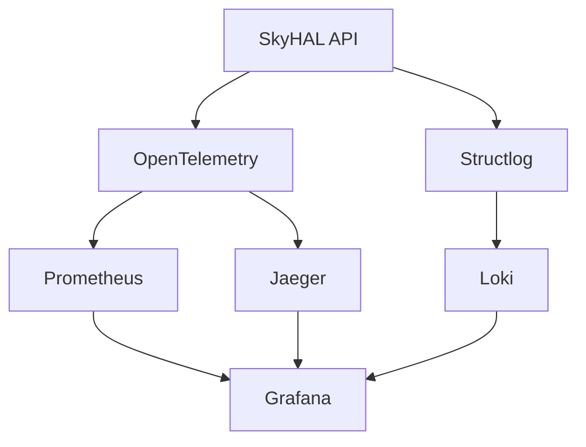

# Especificação Técnica: Documentação de Observabilidade

## 📁 Artefato

**Caminho:** `docs/observabilidade/`

## 🎯 Objetivo

Criar documentação técnica completa sobre a stack de observabilidade implementada, incluindo guias de uso, padrões, troubleshooting e melhores práticas para desenvolvedores e operadores.

## 📚 Instruções Relacionadas

- **documentation.instructions.md** - Padrões de documentação do projeto
- **observabilidade.instructions.md** - Padrões técnicos de observabilidade
- **copilot-specific.instructions.md** - Formato e estilo de documentação

## 🎨 Prompts Relacionados

- **documentation-generation.prompt.md** - Geração de documentação técnica
- **observabilidade.prompt.md** - Documentação específica de observabilidade

## 🎯 Chat Mode Recomendado

- **arquiteto.chatmode.md** - Para documentação de arquitetura

## 🏗️ Estrutura de Documentação

```text
docs/observabilidade/
├── README.md                           # Visão geral da stack
├── quickstart.md                       # Guia de início rápido
├── architecture.md                     # Arquitetura da observabilidade
├── configuration/
│   ├── README.md                      # Visão geral de configurações
│   ├── logging.md                     # Configuração de logs
│   ├── metrics.md                     # Configuração de métricas
│   ├── tracing.md                     # Configuração de tracing
│   └── exporters.md                   # Configuração de exportadores
├── usage/
│   ├── README.md                      # Guia de uso geral
│   ├── developers.md                  # Guia para desenvolvedores
│   ├── operators.md                   # Guia para operadores
│   └── troubleshooting.md             # Guia de troubleshooting
├── dashboards/
│   ├── README.md                      # Documentação de dashboards
│   ├── api-overview.md                # Dashboard principal da API
│   ├── red-metrics.md                 # Dashboard de métricas RED
│   └── custom-dashboards.md           # Criação de dashboards customizados
├── alerts/
│   ├── README.md                      # Visão geral de alertas
│   ├── rules.md                       # Regras de alerta configuradas
│   └── runbooks.md                    # Runbooks para alertas
└── examples/
    ├── README.md                      # Exemplos de uso
    ├── code-instrumentation.md       # Instrumentação de código
    ├── custom-metrics.md              # Criação de métricas customizadas
    └── log-correlation.md             # Correlação de logs e traces
```

## 🛠️ Implementação da Documentação

### 1. Visão Geral (`docs/observabilidade/README.md`)

```markdown
# Stack de Observabilidade SkyHAL

## 🎯 Visão Geral

A stack de observabilidade do SkyHAL oferece visibilidade completa sobre o comportamento da aplicação através de três pilares fundamentais:

- **📊 Métricas** - Medições quantitativas do sistema (Prometheus)
- **📝 Logs** - Eventos estruturados em JSON (Loki)
- **🔍 Traces** - Rastreamento distribuído de requisições (Jaeger)

## 🏗️ Arquitetura



## 🚀 Links Rápidos

- [🏃 Guia de Início Rápido](./quickstart.md)
- [⚙️ Configuração](./configuration/README.md)
- [💻 Uso para Desenvolvedores](./usage/developers.md)
- [🔧 Uso para Operadores](./usage/operators.md)
- [🚨 Troubleshooting](./usage/troubleshooting.md)

## 📋 Componentes

### Coleta e Instrumentação
- **OpenTelemetry** - SDK para instrumentação automática
- **Structlog** - Logging estruturado em JSON
- **Middleware customizado** - Instrumentação de requisições HTTP

### Armazenamento
- **Prometheus** - Métricas temporais
- **Jaeger** - Traces distribuídos
- **Loki** - Logs estruturados

### Visualização
- **Grafana** - Dashboards e alertas
- **Jaeger UI** - Interface de traces
- **Prometheus UI** - Interface de métricas

## ⚡ Início Rápido

1. **Iniciar a stack:**
   ```bash
   cd infra/grafana
   ./scripts/setup.sh
   ```

2. **Acessar interfaces:**
   - Grafana: http://localhost:3000 (admin/admin123)
   - Prometheus: http://localhost:9090
   - Jaeger: http://localhost:16686

3. **Fazer uma requisição de teste:**
   ```bash
   curl http://localhost:8000/health
   ```

4. **Visualizar no Grafana:**
   - Acesse o dashboard "SkyHAL API - Overview"
   - Verifique métricas, logs e traces correlacionados

## 📖 Documentação Adicional

- [Arquitetura Detalhada](./architecture.md)
- [Configurações](./configuration/README.md)
- [Exemplos de Uso](./examples/README.md)
- [Dashboards](./dashboards/README.md)
- [Alertas](./alerts/README.md)
```

### 2. Guia de Início Rápido (`docs/observabilidade/quickstart.md`)

```markdown
# 🏃 Guia de Início Rápido - Observabilidade

## Pré-requisitos

- Docker e Docker Compose instalados
- Python 3.11+
- Poetry configurado
- SkyHAL API rodando na porta 8000

## 1. Configuração Inicial

### Instalar Dependências

```bash
# Instalar dependências de observabilidade
poetry install

# Verificar instalação
poetry run python -c "import opentelemetry; print('OpenTelemetry OK')"
```

### Configurar Variáveis de Ambiente

```bash
# Criar arquivo .env
cat > .env << EOF
ENVIRONMENT=development
LOG_LEVEL=INFO
PROMETHEUS_PORT=8000
JAEGER_ENDPOINT=http://localhost:14268/api/traces
SERVICE_NAME=skyhal-api
SERVICE_VERSION=0.1.0
EOF
```

## 2. Iniciar Stack de Observabilidade

```bash
# Navegar para pasta de infraestrutura
cd infra/grafana

# Executar script de setup
chmod +x scripts/setup.sh
./scripts/setup.sh

# Verificar se serviços estão rodando
docker-compose ps
```

## 3. Iniciar Aplicação

```bash
# Retornar para raiz do projeto
cd ../..

# Iniciar API com observabilidade
poetry run uvicorn src.presentation.api.app:app --host 0.0.0.0 --port 8000
```

## 4. Verificar Funcionamento

### Gerar Tráfego de Teste

```bash
# Requisições de sucesso
for i in {1..10}; do
  curl -s http://localhost:8000/health
done

# Requisições que geram métricas variadas
curl -s http://localhost:8000/docs
curl -s http://localhost:8000/openapi.json
```

### Verificar Métricas

```bash
# Acessar endpoint de métricas
curl http://localhost:8000/metrics | grep skyhal
```

## 5. Acessar Interfaces

### Grafana (Principal)
- **URL:** http://localhost:3000
- **Login:** admin / admin123
- **Dashboard:** "SkyHAL API - Overview"

### Prometheus
- **URL:** http://localhost:9090
- **Query exemplo:** `rate(app_http_requests_total[5m])`

### Jaeger
- **URL:** http://localhost:16686
- **Buscar:** Serviço "skyhal-api"

## 6. Validar Correlação

1. **Fazer requisição com erro:**
   ```bash
   curl http://localhost:8000/nonexistent
   ```

2. **No Grafana:**
   - Ver aumento na métrica de erro
   - Clicar no trace ID nos logs
   - Navegar para Jaeger automaticamente

3. **No Jaeger:**
   - Ver span da requisição com erro
   - Verificar atributos e tags

## 🎯 Próximos Passos

- [📖 Documentação Completa](./README.md)
- [⚙️ Configurações Avançadas](./configuration/README.md)
- [💻 Guia para Desenvolvedores](./usage/developers.md)
- [📊 Dashboards Customizados](./dashboards/README.md)

## ⚠️ Troubleshooting

### Problemas Comuns

**Erro "Connection refused" no Prometheus:**
```bash
# Verificar se app está expondo métricas
curl http://localhost:8000/metrics

# Verificar logs do Prometheus
docker-compose logs prometheus
```

**Grafana não carrega dashboards:**
```bash
# Verificar permissões
sudo chown -R 472:472 grafana/data

# Reiniciar Grafana
docker-compose restart grafana
```

**Traces não aparecem no Jaeger:**
```bash
# Verificar configuração OpenTelemetry
grep -r "jaeger" config/

# Verificar logs do Jaeger
docker-compose logs jaeger
```
```

### 3. Guia para Desenvolvedores (`docs/observabilidade/usage/developers.md`)

```markdown
# 💻 Guia de Observabilidade para Desenvolvedores

## 🎯 Visão Geral

Este guia ensina como instrumentar código Python para a stack de observabilidade do SkyHAL, incluindo logging estruturado, métricas customizadas e tracing manual.

## 📝 Logging Estruturado

### Configuração Básica

```python
import structlog

# Obter logger estruturado
logger = structlog.get_logger(__name__)

# Log básico
logger.info("user_action", user_id=123, action="login")

# Log com contexto adicional
logger.info(
    "order_created",
    order_id="ord_123",
    user_id=456,
    amount=99.99,
    currency="BRL"
)
```

### Boas Práticas de Logging

```python
# ✅ BOM - Estruturado com contexto
logger.info(
    "payment_processed",
    payment_id=payment.id,
    amount=payment.amount,
    status="success",
    duration_ms=processing_time
)

# ❌ RUIM - String não estruturada
logger.info(f"Payment {payment.id} processed successfully")

# ✅ BOM - Log de erro com contexto
logger.error(
    "payment_failed",
    payment_id=payment.id,
    error_code="INSUFFICIENT_FUNDS",
    user_id=user.id,
    exc_info=True
)

# ⚠️ CUIDADO - Nunca logar dados sensíveis
logger.info(
    "user_authenticated",
    user_id=user.id,
    # password=user.password  # ❌ NUNCA FAZER!
)
```

## 📊 Métricas Customizadas

### Instrumentação Manual

```python
from opentelemetry import metrics
from src.infrastructure.observability.providers.telemetry_provider import TelemetryProvider

class PaymentService:
    def __init__(self):
        self.telemetry = TelemetryProvider()
        self.meter = self.telemetry.get_meter(__name__)

        # Contador de pagamentos
        self.payment_counter = self.meter.create_counter(
            name="skyhal_payments_total",
            description="Total de pagamentos processados",
            unit="1"
        )

        # Histograma de valores
        self.payment_amount = self.meter.create_histogram(
            name="skyhal_payment_amount",
            description="Valores de pagamento",
            unit="BRL"
        )

    async def process_payment(self, payment: Payment) -> PaymentResult:
        # Incrementar contador
        self.payment_counter.add(
            1,
            attributes={
                "payment_method": payment.method,
                "currency": payment.currency
            }
        )

        # Registrar valor
        self.payment_amount.record(
            payment.amount,
            attributes={"currency": payment.currency}
        )

        # ... lógica de processamento
```

### Decorador para Métricas

```python
from functools import wraps
import time

def track_duration(metric_name: str):
    """Decorator para rastrear duração de operações."""
    def decorator(func):
        @wraps(func)
        async def wrapper(*args, **kwargs):
            start_time = time.time()

            # Executar função
            try:
                result = await func(*args, **kwargs)
                status = "success"
                return result
            except Exception as e:
                status = "error"
                raise
            finally:
                duration = time.time() - start_time

                # Registrar métrica
                # (implementação depende do contexto)
                logger.info(
                    "operation_completed",
                    operation=func.__name__,
                    duration_seconds=duration,
                    status=status
                )

        return wrapper
    return decorator

# Uso do decorator
@track_duration("user_creation")
async def create_user(user_data: dict) -> User:
    # ... lógica de criação
    pass
```

## 🔍 Tracing Manual

### Instrumentação de Spans

```python
from opentelemetry import trace

class UserService:
    def __init__(self):
        self.tracer = trace.get_tracer(__name__)

    async def create_user(self, user_data: dict) -> User:
        with self.tracer.start_as_current_span("user_service.create_user") as span:
            # Adicionar atributos
            span.set_attribute("user.email", user_data["email"])
            span.set_attribute("user.role", user_data["role"])

            try:
                # Validação
                with self.tracer.start_as_current_span("user_service.validate") as validate_span:
                    validate_span.set_attribute("validation.fields", len(user_data))
                    self._validate_user_data(user_data)

                # Criação no banco
                with self.tracer.start_as_current_span("user_service.database_create") as db_span:
                    user = await self._create_in_database(user_data)
                    db_span.set_attribute("user.id", user.id)

                # Marcar sucesso
                span.set_status(trace.Status(trace.StatusCode.OK))
                span.set_attribute("user.created.id", user.id)

                return user

            except ValidationError as e:
                span.set_status(trace.Status(trace.StatusCode.ERROR, str(e)))
                span.record_exception(e)
                raise
            except Exception as e:
                span.set_status(trace.Status(trace.StatusCode.ERROR, "Internal error"))
                span.record_exception(e)
                raise
```

### Propagação de Contexto

```python
from opentelemetry import trace
from opentelemetry.trace.propagation.tracecontext import TraceContextTextMapPropagator

class ExternalServiceClient:
    def __init__(self):
        self.propagator = TraceContextTextMapPropagator()

    async def call_external_api(self, data: dict) -> dict:
        """Chama API externa propagando contexto de trace."""

        # Obter contexto atual
        headers = {}
        self.propagator.inject(headers)

        # Fazer requisição com headers de trace
        async with httpx.AsyncClient() as client:
            response = await client.post(
                "https://external-api.com/endpoint",
                json=data,
                headers=headers
            )

        return response.json()
```

## 🧪 Testando Observabilidade

### Teste de Logs

```python
import pytest
from unittest.mock import patch
import structlog

def test_user_creation_logs_correctly():
    """Testa se criação de usuário gera logs corretos."""

    with patch('structlog.get_logger') as mock_logger:
        logger_instance = mock_logger.return_value

        # Executar operação
        service = UserService()
        user = service.create_user({"email": "test@example.com"})

        # Verificar logs
        logger_instance.info.assert_called_with(
            "user_created",
            user_id=user.id,
            email="test@example.com"
        )
```

### Teste de Métricas

```python
def test_payment_metrics_recorded():
    """Testa se métricas de pagamento são registradas."""

    with patch.object(PaymentService, 'payment_counter') as mock_counter:
        service = PaymentService()

        # Executar operação
        service.process_payment(Payment(amount=100.0, method="card"))

        # Verificar métrica
        mock_counter.add.assert_called_with(
            1,
            attributes={"payment_method": "card", "currency": "BRL"}
        )
```

## 📋 Checklist para Desenvolvedores

### Antes de Fazer Commit

- [ ] Logs estruturados implementados
- [ ] Dados sensíveis não estão sendo logados
- [ ] Métricas relevantes adicionadas
- [ ] Spans de trace têm atributos descritivos
- [ ] Erros são capturados e trackeados
- [ ] Testes de observabilidade criados

### Revisão de Código

- [ ] Logs seguem padrão estruturado
- [ ] Métricas têm labels apropriadas
- [ ] Traces têm granularidade adequada
- [ ] Não há overhead excessivo
- [ ] Correlação entre logs/métricas/traces funciona

## 🔗 Recursos Adicionais

- [Padrões de Nomenclatura](../configuration/metrics.md)
- [Exemplos de Código](../examples/code-instrumentation.md)
- [Troubleshooting](./troubleshooting.md)
```

## ✅ Checklist de Implementação

- [ ] Criar estrutura completa de documentação
- [ ] Implementar README principal com visão geral
- [ ] Criar guia de início rápido detalhado
- [ ] Documentar arquitetura da observabilidade
- [ ] Criar guias específicos por audiência (dev/ops)
- [ ] Documentar configurações e exemplos
- [ ] Criar guia de troubleshooting
- [ ] Documentar dashboards e alertas
- [ ] Incluir exemplos práticos de código
- [ ] Validar links e referências cruzadas

## 🔗 Dependências de Outros Artefatos

- **observability-infrastructure.md** - Documenta componentes implementados
- **observability-middleware.md** - Documenta instrumentação automática
- **observability-config.md** - Documenta configurações
- **grafana-setup.md** - Documenta dashboards e alertas

## 📝 Notas Técnicas

- Documentação segue padrões do `documentation.instructions.md`
- Inclui diagramas Mermaid para visualização
- Exemplos de código são testáveis
- Links internos facilitam navegação
- Guias específicos por audiência (desenvolvedores/operadores)
- Troubleshooting cobre cenários comuns
