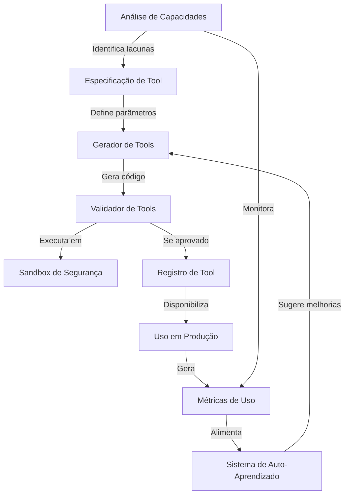
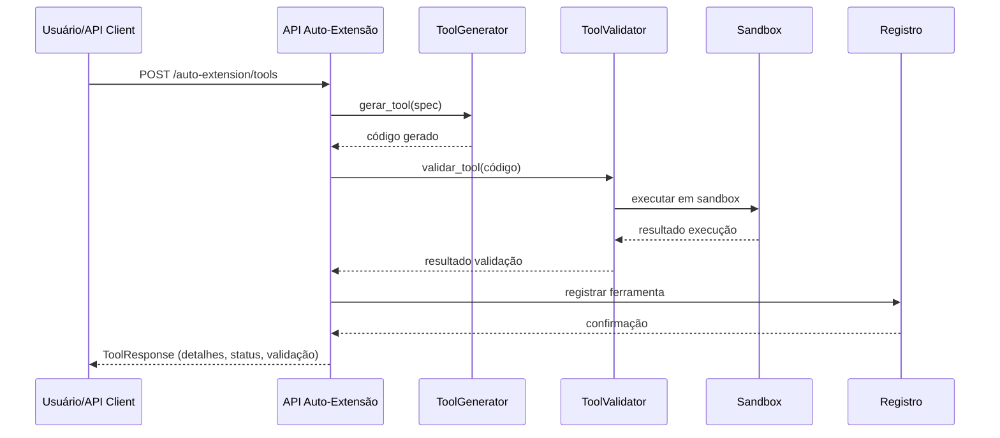

# Arquitetura do Sistema de Auto-Extensão MCP

## Visão Geral

O sistema de auto-extensão MCP permite ao SkyHAL identificar suas próprias limitações e gerar novas ferramentas (tools) para superá-las, tornando o sistema adaptável e evolutivo. A arquitetura segue Clean Architecture, com separação clara entre domínio, aplicação, infraestrutura e apresentação.

---

## Componentes Principais

- **API de Auto-Extensão**: expõe endpoints REST para análise de capacidades, geração de ferramentas, feedback e consulta de gaps.
- **Capability Analyzer**: identifica lacunas de capacidade a partir de métricas e feedback.
- **Tool Generator**: gera código Python seguro e testável para novas ferramentas.
- **Tool Validator**: valida segurança, funcionalidade e performance das ferramentas geradas.
- **Self-Learning System**: coleta métricas de uso, analisa padrões e sugere melhorias.
- **Sandbox de Segurança**: executa código gerado de forma isolada, controlando recursos e permissões.
- **Observabilidade**: métricas, tracing e logs estruturados para todo o fluxo.

---

## Fluxo Principal



---

## Contratos de API (Exemplo)

### 1. Listar Gaps de Capacidade

- **GET** `/auto-extension/capability-gaps`
- **Resposta:**

```json
{
  "gaps": [
    {"id": "gap-1", "type": "data_processing", "description": "Falta integração com API externa X"}
  ]
}
```

### 2. Gerar Nova Tool

- **POST** `/auto-extension/tools`
- **Body:**

```json
{
  "gap_id": "gap-1",
  "parameters": {"api_key": "..."}
}
```

- **Resposta:**

```json
{
  "tool_id": "tool-123",
  "name": "IntegradorX",
  "validation_results": {"passed": true, "score": 0.95, "issues_count": 0}
}
```

### 3. Submeter Feedback

- **POST** `/auto-extension/tools/{tool_id}/feedback`
- **Body:**

```json
{
  "rating": 4,
  "comments": "Funciona bem, mas falta documentação."
}
```

---

## Exemplos de Uso

1. Consultar gaps → gerar ferramenta → validar → usar → enviar feedback.
2. Automatizar geração de ferramentas para gaps recorrentes.

---

---

## Modelos de Dados (Pydantic)

### ToolRequest

```python
class ToolRequest(BaseModel):
    name: str
    description: str
    parameters: Dict[str, Any]
    return_type: str = "object"
    template_id: Optional[str] = None
    security_level: str = "standard"
    resource_requirements: Dict[str, Any] = {}
```

**Exemplo de payload:**

```json
{
  "name": "IntegradorX",
  "description": "Integra com API X",
  "parameters": {"api_key": "string", "timeout": 10},
  "return_type": "dict",
  "security_level": "standard"
}
```

### CapabilityGap

```python
class CapabilityGap(BaseModel):
    gap_id: str
    capability_type: str
    description: str
    severity: int
    detection_source: str
    frequency: int
    possible_solutions: List[str]
```

**Exemplo de resposta:**

```json
{
  "gap_id": "gap-1",
  "capability_type": "external_integration",
  "description": "Falta de integração com APIs de redes sociais",
  "severity": 4,
  "detection_source": "feedback",
  "frequency": 3,
  "possible_solutions": ["Desenvolver connector específico"]
}
```

### ToolResponse

```python
class ToolResponse(BaseModel):
    tool_id: str
    name: str
    description: str
    status: str
    version: str
    created_at: str
    code: str
    validation_results: Dict[str, Any]
```

**Exemplo de resposta:**

```json
{
  "tool_id": "tool-123",
  "name": "IntegradorX",
  "description": "Integra com API X",
  "status": "active",
  "version": "1.0.0",
  "created_at": "2025-06-25T12:00:00Z",
  "code": "def IntegradorX(api_key, timeout): ...",
  "validation_results": {"passed": true, "score": 0.95, "issues_count": 0}
}
```

### FeedbackRequest

```python
class FeedbackRequest(BaseModel):
    rating: int
    comments: Optional[str]
    issues: List[str] = []
    context: Optional[Dict[str, Any]] = None
```

**Exemplo de payload:**

```json
{
  "rating": 4,
  "comments": "Funciona bem, mas falta documentação.",
  "issues": ["Faltam exemplos de uso"],
  "context": {"user": "dev-armando"}
}
```

---

## Fluxos de Fallback e Tratamento de Erros

- Todos os endpoints retornam erros estruturados (HTTPException) com logging via structlog.
- Exemplo de resposta de erro:

```json
{
  "error": {
    "code": 500,
    "message": "Erro ao criar ferramenta"
  }
}
```

- Falhas de validação retornam 400, erros de permissão 403/401, não encontrado 404.
- Logs estruturados incluem trace_id, tool_id, contexto e detalhes do erro.

---

## Próximos Passos

---

## Observabilidade do Sistema de Auto-Extensão MCP

### Métricas (Prometheus/OpenTelemetry)

- `auto_extension_tools_created_total`: total de ferramentas geradas
- `auto_extension_tool_validation_failures_total`: falhas de validação
- `auto_extension_requests_duration_seconds`: latência dos endpoints
- `auto_extension_feedback_count`: feedbacks recebidos por ferramenta

**Exemplo de instrumentação (Python):**

```python
from prometheus_client import Counter, Histogram

tools_created = Counter('auto_extension_tools_created_total', 'Total de ferramentas geradas')
validation_failures = Counter('auto_extension_tool_validation_failures_total', 'Falhas de validação')
request_latency = Histogram('auto_extension_requests_duration_seconds', 'Latência dos endpoints')

@app.post('/auto-extension/tools')
@request_latency.time()
async def create_tool(...):
    try:
        ...
        tools_created.inc()
    except ValidationError:
        validation_failures.inc()
        raise
```

### Tracing (OpenTelemetry)

- Todos os endpoints e operações críticas devem criar spans:
  - `auto_extension.create_tool`
  - `auto_extension.validate_tool`
  - `auto_extension.process_feedback`
- Incluir atributos: `tool_id`, `user_id`, `trace_id`, `status`

**Exemplo:**

```python
from opentelemetry import trace
tracer = trace.get_tracer(__name__)

with tracer.start_as_current_span("auto_extension.create_tool") as span:
    span.set_attribute("tool_id", tool_id)
    ...
```

### Logging Estruturado (structlog)

- Todos os logs devem ser em JSON, incluir contexto (tool_id, trace_id, user, status)
- Níveis: info (ações), warning (anomalias), error (falhas)

**Exemplo:**

```python
import structlog
logger = structlog.get_logger()
logger.info("tool_created", tool_id=tool_id, user_id=user_id, status="success")
logger.error("erro_criar_ferramenta", tool_id=tool_id, error=str(e), trace_id=trace_id)
```

### Dashboards e Alertas (Grafana)

- Dashboard dedicado: métricas de criação, validação, uso e feedback de ferramentas
- Alertas para:
  - Falha consecutiva de validação
  - Latência acima de 1s
  - Taxa de erro > 1%

---

## Referências e ADRs

[Observabilidade - Padrões e Boas Práticas](../../observabilidade/README.md)
ADR-011: Decisão arquitetural sobre auto-extensão (a criar)

---

## Diagrama de Sequência – Criação de Ferramenta



---

## Runbook e Troubleshooting

### Operação

- Verificar saúde: GET `/auto-extension/health`
- Consultar métricas: endpoint Prometheus `/metrics`
- Validar logs: Loki/Grafana (filtro por `tool_id`, `trace_id`)

### Problemas Comuns

- **Erro 500 ao criar ferramenta**: checar logs de validação, quota de sandbox, dependências externas
- **Validação falha sempre**: revisar template, dependências do ambiente, permissões de sandbox
- **Latência alta**: verificar métricas de `auto_extension_requests_duration_seconds`, uso de recursos

### Passos de Diagnóstico

1. Consultar dashboard Grafana para alertas recentes
2. Buscar trace_id no log estruturado para rastrear fluxo
3. Validar status do sandbox e recursos disponíveis
4. Testar endpoint de health e dependências externas

### Recuperação

- Reiniciar serviço de sandbox se indisponível
- Ajustar quotas ou limites de recursos
- Corrigir templates ou dependências quebradas

---

> Documento em evolução. Atualize conforme decisões e implementação.
