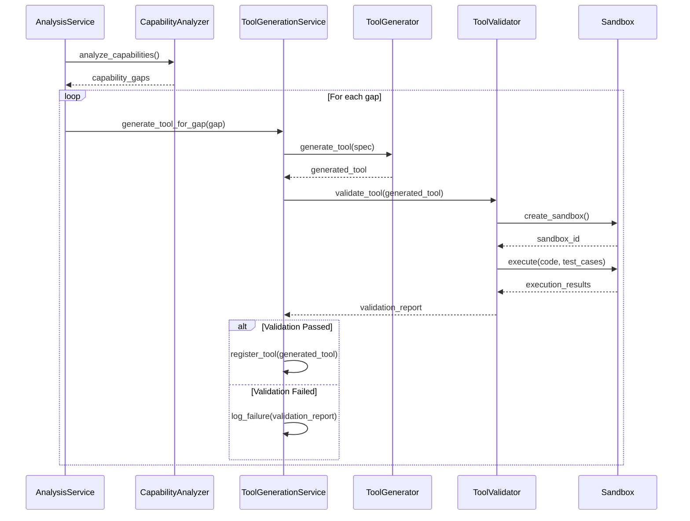
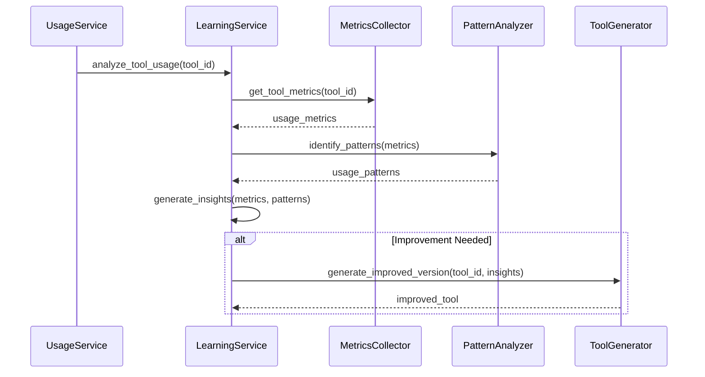

# Especificação Técnica - Sistema Base de Auto-Extensão MCP

## 🎯 Visão Geral

Esta especificação detalha a implementação do sistema core do SkyHAL que permitirá auto-identificação de limitações e auto-criação de novas tools para superá-las. O sistema será baseado nos princípios da Clean Architecture, seguindo os padrões de desenvolvimento Python MCP, com foco em segurança, observabilidade e extensibilidade.

## 📋 Artefatos Afetados/Criados

### 1. Arquitetura do Sistema
**Arquivo:** `docs/especificacoes-tecnicas/issue-11-auto-extensao-mcp.md`

### 2. Core do Sistema de Auto-Extensão
**Diretório:** `src/domain/auto_extension/`
**Arquivos:**
- `__init__.py`
- `capability_analyzer.py`
- `tool_generator.py`
- `tool_validator.py`
- `learning_system.py`
- `entities/`

### 3. Serviços de Aplicação
**Diretório:** `src/application/auto_extension/`
**Arquivos:**
- `__init__.py`
- `capability_analysis_service.py`
- `tool_generation_service.py`
- `learning_service.py`

### 4. Infraestrutura
**Diretório:** `src/infrastructure/auto_extension/`
**Arquivos:**
- `__init__.py`
- `sandbox/`
- `repositories/`
- `security/`

### 5. API e Apresentação
**Diretório:** `src/presentation/api/routers/`
**Arquivos:**
- `auto_extension.py`

### 6. Testes
**Diretório:** `tests/`
**Arquivos em:**
- `tests/unit/domain/auto_extension/`
- `tests/unit/application/auto_extension/`
- `tests/integration/auto_extension/`

### 7. Observabilidade
**Diretório:** `src/infrastructure/observability/`
**Arquivos:**
- `auto_extension_metrics.py`
- `auto_extension_traces.py`

### 8. Documentação
**Diretórios:**
- `docs/auto_extension/`
- `docs/especificacoes-tecnicas/artefatos/`

## 📝 Especificações Técnicas Detalhadas

### 1. Arquitetura do Sistema

**Arquivo:** `docs/especificacoes-tecnicas/issue-11-auto-extensao-mcp.md`

**Descrição:** Documento que detalha a arquitetura geral do sistema de auto-extensão, incluindo componentes, fluxos, interfaces e considerações de segurança.

**Conteúdo:**
- Visão geral da arquitetura
- Diagrama de componentes
- Fluxos de comunicação
- Interfaces e contratos
- Considerações de segurança
- Mecanismos de fallback
- Estratégia de observabilidade
- Evolução futura

**Instructions Relacionadas:**
- `global.instructions.md`: Diretrizes gerais de arquitetura
- `documentation.instructions.md`: Padrões de documentação
- `memory-bank.instructions.md`: Integração com Memory Bank

**Prompts Relacionados:**
- `sequential-planning.prompt.md`: Para planejamento estruturado
- `memory-analysis.prompt.md`: Para análise de contexto

**Chat Mode Recomendado:**
- `arquiteto.chatmode.md`: Para definição da arquitetura

### 2. Sistema de Análise de Capacidades

**Diretório:** `src/domain/auto_extension/`
**Arquivo Principal:** `capability_analyzer.py`

**Descrição:** Componente responsável por analisar as capacidades atuais do sistema, identificar limitações e áreas para melhoria.

**Funcionalidades Principais:**
- Detecção de limitações atuais baseada em feedback e métricas
- Classificação de tipos de tarefas que precisam de melhoria
- Análise de performance por tipo de tarefa
- Geração de recomendações para novas tools

**Exemplo de Implementação:**
```python
from dataclasses import dataclass
from typing import List, Dict, Any, Optional
from enum import Enum

class CapabilityType(Enum):
    DATA_PROCESSING = "data_processing"
    TEXT_GENERATION = "text_generation"
    CODE_ANALYSIS = "code_analysis"
    EXTERNAL_INTEGRATION = "external_integration"
    REASONING = "reasoning"

@dataclass
class CapabilityGap:
    """Representa uma lacuna identificada nas capacidades atuais."""
    capability_type: CapabilityType
    description: str
    severity: float  # 0.0 a 1.0
    frequency: float  # 0.0 a 1.0
    examples: List[str]
    potential_solutions: List[str]

class CapabilityAnalyzer:
    """Analisador de capacidades do sistema."""

    def __init__(self, metrics_provider, feedback_provider):
        self.metrics_provider = metrics_provider
        self.feedback_provider = feedback_provider
        self.logger = setup_logger(__name__)

    async def analyze_capabilities(self) -> List[CapabilityGap]:
        """Analisa capacidades atuais e identifica lacunas."""
        try:
            metrics = await self.metrics_provider.get_performance_metrics()
            feedback = await self.feedback_provider.get_recent_feedback()

            # Análise de métricas e feedback
            gaps = self._identify_gaps(metrics, feedback)

            self.logger.info(
                "capability_analysis_completed",
                gaps_found=len(gaps),
                severity_avg=sum(gap.severity for gap in gaps) / len(gaps) if gaps else 0
            )

            return gaps
        except Exception as e:
            self.logger.error("capability_analysis_failed", exc_info=e)
            raise

    def _identify_gaps(self, metrics: Dict[str, Any], feedback: List[Dict[str, Any]]) -> List[CapabilityGap]:
        # Implementação da lógica de identificação de lacunas
        # ...
```

**Instructions Relacionadas:**
- `python-mcp.instructions.md`: Padrões de desenvolvimento Python
- `observabilidade.instructions.md`: Integração de métricas e logs

**Prompts Relacionados:**
- `entity-management.prompt.md`: Para modelagem de entidades de domínio

### 3. Gerador de Tools

**Diretório:** `src/domain/auto_extension/`
**Arquivo Principal:** `tool_generator.py`

**Descrição:** Componente responsável por gerar novas tools baseadas nas lacunas identificadas pelo analisador de capacidades.

**Funcionalidades Principais:**
- Template engine para criação de novas tools
- Geração de código baseado em especificações
- Integração com sandbox para teste seguro
- Sistema de versões para tools geradas

**Exemplo de Implementação:**
```python
from dataclasses import dataclass
from typing import Dict, Any, List, Optional
import uuid

@dataclass
class ToolSpec:
    """Especificação para geração de uma nova tool."""
    name: str
    description: str
    parameters: Dict[str, Any]
    return_type: str
    template_id: str
    security_level: str
    resource_requirements: Dict[str, Any]

@dataclass
class GeneratedTool:
    """Resultado da geração de uma nova tool."""
    tool_id: str
    name: str
    code: str
    spec: ToolSpec
    validation_results: Dict[str, Any]
    version: str
    created_at: str

class ToolGenerator:
    """Gerador de novas tools baseado em especificações."""

    def __init__(self, template_provider, code_generator, security_validator):
        self.template_provider = template_provider
        self.code_generator = code_generator
        self.security_validator = security_validator
        self.logger = setup_logger(__name__)

    async def generate_tool(self, spec: ToolSpec) -> GeneratedTool:
        """Gera uma nova tool baseada na especificação."""
        try:
            # Validar especificação
            self._validate_spec(spec)

            # Obter template
            template = await self.template_provider.get_template(spec.template_id)

            # Gerar código
            code = await self.code_generator.generate(template, spec)

            # Validar segurança
            validation_results = await self.security_validator.validate(code, spec)

            # Criar tool
            tool = GeneratedTool(
                tool_id=str(uuid.uuid4()),
                name=spec.name,
                code=code,
                spec=spec,
                validation_results=validation_results,
                version="1.0.0",
                created_at=datetime.utcnow().isoformat()
            )

            self.logger.info(
                "tool_generated",
                tool_id=tool.tool_id,
                name=tool.name,
                validation_status="success" if validation_results["passed"] else "failed"
            )

            return tool
        except Exception as e:
            self.logger.error("tool_generation_failed", spec_name=spec.name, exc_info=e)
            raise

    def _validate_spec(self, spec: ToolSpec) -> None:
        # Implementação da validação de especificação
        # ...
```

**Instructions Relacionadas:**
- `python-mcp.instructions.md`: Padrões de desenvolvimento Python
- `api-security.instructions.md`: Segurança em desenvolvimento

**Prompts Relacionados:**
- `code-generation.prompt.md`: Para geração de código seguro

### 4. Sistema de Validação de Tools

**Diretório:** `src/domain/auto_extension/`
**Arquivo Principal:** `tool_validator.py`

**Descrição:** Componente responsável por validar e testar as tools geradas antes de sua integração ao sistema.

**Funcionalidades Principais:**
- Validação de segurança e permissões
- Testes automatizados em sandbox
- Verificação de conformidade com contratos
- Análise estática de código

**Exemplo de Implementação:**
```python
from dataclasses import dataclass
from typing import Dict, Any, List, Optional
from enum import Enum

class ValidationResult(Enum):
    PASSED = "passed"
    FAILED_SECURITY = "failed_security"
    FAILED_FUNCTIONALITY = "failed_functionality"
    FAILED_PERFORMANCE = "failed_performance"
    FAILED_COMPATIBILITY = "failed_compatibility"

@dataclass
class ValidationReport:
    """Relatório detalhado da validação de uma tool."""
    tool_id: str
    result: ValidationResult
    security_score: float  # 0.0 a 1.0
    performance_score: float  # 0.0 a 1.0
    test_results: Dict[str, Any]
    issues: List[Dict[str, Any]]
    recommendations: List[str]

class ToolValidator:
    """Validador de tools geradas."""

    def __init__(self, sandbox_provider, security_analyzer, test_runner):
        self.sandbox_provider = sandbox_provider
        self.security_analyzer = security_analyzer
        self.test_runner = test_runner
        self.logger = setup_logger(__name__)

    async def validate_tool(self, tool: GeneratedTool) -> ValidationReport:
        """Valida uma tool gerada em ambiente sandbox."""
        try:
            # Análise de segurança
            security_results = await self.security_analyzer.analyze(tool.code)

            # Preparar sandbox
            sandbox = await self.sandbox_provider.create_sandbox()

            # Executar testes
            with tracer.start_as_current_span("tool_validation_tests") as span:
                span.set_attribute("tool_id", tool.tool_id)
                test_results = await self.test_runner.run_tests(sandbox, tool)

            # Análise dos resultados
            result, issues, recommendations = self._analyze_results(security_results, test_results)

            # Criar relatório
            report = ValidationReport(
                tool_id=tool.tool_id,
                result=result,
                security_score=security_results["score"],
                performance_score=test_results.get("performance_score", 0.0),
                test_results=test_results,
                issues=issues,
                recommendations=recommendations
            )

            self.logger.info(
                "tool_validation_completed",
                tool_id=tool.tool_id,
                result=result.value,
                security_score=security_results["score"],
                issues_count=len(issues)
            )

            return report
        except Exception as e:
            self.logger.error("tool_validation_failed", tool_id=tool.tool_id, exc_info=e)
            raise
        finally:
            # Limpar sandbox
            await self.sandbox_provider.destroy_sandbox(sandbox)

    def _analyze_results(self, security_results, test_results):
        # Implementação da análise de resultados
        # ...
```

**Instructions Relacionadas:**
- `test.instructions.md`: Padrões de testes
- `api-security.instructions.md`: Segurança em desenvolvimento

**Prompts Relacionados:**
- `generate-tests.prompt.md`: Para geração de testes automatizados
- `security-analysis.prompt.md`: Para análise de segurança

### 5. Sistema de Auto-Aprendizado

**Diretório:** `src/domain/auto_extension/`
**Arquivo Principal:** `learning_system.py`

**Descrição:** Componente responsável pelo aprendizado contínuo baseado no uso e feedback das tools criadas.

**Funcionalidades Principais:**
- Coleta de métricas de uso de tools
- Análise de efetividade
- Ajuste automático de parâmetros
- Identificação de padrões de uso

**Exemplo de Implementação:**
```python
from dataclasses import dataclass
from typing import Dict, Any, List, Optional
import time

@dataclass
class ToolUsageMetrics:
    """Métricas de uso de uma tool."""
    tool_id: str
    invocation_count: int
    success_rate: float
    average_execution_time: float
    error_types: Dict[str, int]
    user_ratings: List[float]
    last_used_at: float

@dataclass
class LearningInsight:
    """Insight gerado pelo sistema de aprendizado."""
    tool_id: str
    suggested_improvements: List[str]
    parameter_adjustments: Dict[str, Any]
    usage_patterns: Dict[str, Any]
    performance_bottlenecks: List[str]

class LearningSystem:
    """Sistema de auto-aprendizado baseado em uso de tools."""

    def __init__(self, metrics_collector, pattern_analyzer):
        self.metrics_collector = metrics_collector
        self.pattern_analyzer = pattern_analyzer
        self.logger = setup_logger(__name__)

    async def analyze_tool_usage(self, tool_id: str) -> LearningInsight:
        """Analisa o uso de uma tool e gera insights."""
        try:
            # Coletar métricas de uso
            with tracer.start_as_current_span("collect_tool_metrics") as span:
                span.set_attribute("tool_id", tool_id)
                metrics = await self.metrics_collector.get_tool_metrics(tool_id)

            # Identificar padrões
            usage_patterns = await self.pattern_analyzer.identify_patterns(metrics)

            # Gerar sugestões de melhoria
            suggestions = self._generate_suggestions(metrics, usage_patterns)

            # Calcular ajustes de parâmetros
            parameter_adjustments = self._calculate_parameter_adjustments(metrics, usage_patterns)

            # Identificar gargalos de performance
            bottlenecks = self._identify_bottlenecks(metrics)

            # Criar insight
            insight = LearningInsight(
                tool_id=tool_id,
                suggested_improvements=suggestions,
                parameter_adjustments=parameter_adjustments,
                usage_patterns=usage_patterns,
                performance_bottlenecks=bottlenecks
            )

            self.logger.info(
                "tool_learning_analysis_completed",
                tool_id=tool_id,
                suggestions_count=len(suggestions),
                bottlenecks_count=len(bottlenecks)
            )

            return insight
        except Exception as e:
            self.logger.error("tool_learning_analysis_failed", tool_id=tool_id, exc_info=e)
            raise

    def _generate_suggestions(self, metrics: ToolUsageMetrics, usage_patterns: Dict[str, Any]) -> List[str]:
        # Implementação da geração de sugestões
        # ...

    def _calculate_parameter_adjustments(self, metrics: ToolUsageMetrics, usage_patterns: Dict[str, Any]) -> Dict[str, Any]:
        # Implementação do cálculo de ajustes
        # ...

    def _identify_bottlenecks(self, metrics: ToolUsageMetrics) -> List[str]:
        # Implementação da identificação de gargalos
        # ...
```

**Instructions Relacionadas:**
- `python-mcp.instructions.md`: Padrões de desenvolvimento Python
- `observabilidade.instructions.md`: Integração de métricas e logs

**Prompts Relacionados:**
- `performance-optimization.prompt.md`: Para otimização de performance

### 6. Sandbox de Segurança

**Diretório:** `src/infrastructure/auto_extension/sandbox/`
**Arquivos Principais:**
- `__init__.py`
- `container_sandbox.py`
- `memory_sandbox.py`
- `permission_manager.py`

**Descrição:** Implementação de ambiente isolado para execução segura de tools geradas, com controle de acesso a recursos e monitoramento.

**Funcionalidades Principais:**
- Isolamento de execução
- Controle de recursos (memória, CPU)
- Monitoramento de operações
- Gestão de permissões
- Timeout e interrupção de execuções

**Exemplo de Implementação:**
```python
from abc import ABC, abstractmethod
from typing import Dict, Any, Optional
import asyncio
import resource
import uuid

class Sandbox(ABC):
    """Interface para ambientes sandbox de execução."""

    @abstractmethod
    async def initialize(self) -> str:
        """Inicializa o ambiente sandbox e retorna ID."""
        pass

    @abstractmethod
    async def execute(self, sandbox_id: str, code: str, params: Dict[str, Any]) -> Dict[str, Any]:
        """Executa código no sandbox com os parâmetros fornecidos."""
        pass

    @abstractmethod
    async def destroy(self, sandbox_id: str) -> None:
        """Destrói o ambiente sandbox."""
        pass

class MemorySandbox(Sandbox):
    """Implementação de sandbox em memória com isolamento de recursos."""

    def __init__(self, permission_manager, resource_limiter):
        self.permission_manager = permission_manager
        self.resource_limiter = resource_limiter
        self.sandboxes = {}
        self.logger = setup_logger(__name__)

    async def initialize(self) -> str:
        """Inicializa um novo sandbox em memória."""
        try:
            sandbox_id = str(uuid.uuid4())

            # Criar ambiente isolado
            self.sandboxes[sandbox_id] = {
                "created_at": time.time(),
                "namespace": {},
                "permissions": self.permission_manager.get_default_permissions(),
                "resources": self.resource_limiter.get_default_limits()
            }

            self.logger.info(
                "sandbox_initialized",
                sandbox_id=sandbox_id
            )

            return sandbox_id
        except Exception as e:
            self.logger.error("sandbox_initialization_failed", exc_info=e)
            raise

    async def execute(self, sandbox_id: str, code: str, params: Dict[str, Any]) -> Dict[str, Any]:
        """Executa código no sandbox com isolamento e limites."""
        if sandbox_id not in self.sandboxes:
            raise ValueError(f"Sandbox {sandbox_id} não encontrado")

        sandbox = self.sandboxes[sandbox_id]

        try:
            # Validar permissões
            self.permission_manager.validate_code(code, sandbox["permissions"])

            # Preparar ambiente de execução
            namespace = sandbox["namespace"].copy()
            namespace.update(params)

            # Configurar limites de recursos
            resource.setrlimit(resource.RLIMIT_CPU, (sandbox["resources"]["cpu_seconds"], sandbox["resources"]["cpu_seconds"]))
            resource.setrlimit(resource.RLIMIT_AS, (sandbox["resources"]["memory_bytes"], sandbox["resources"]["memory_bytes"]))

            # Executar com timeout
            with tracer.start_as_current_span("sandbox_execution") as span:
                span.set_attribute("sandbox_id", sandbox_id)

                result = await asyncio.wait_for(
                    self._execute_code(code, namespace),
                    timeout=sandbox["resources"]["timeout_seconds"]
                )

            self.logger.info(
                "sandbox_execution_completed",
                sandbox_id=sandbox_id,
                execution_time=result.get("execution_time", 0)
            )

            return result
        except asyncio.TimeoutError:
            self.logger.warning(
                "sandbox_execution_timeout",
                sandbox_id=sandbox_id
            )
            return {"error": "Execution timeout", "status": "timeout"}
        except Exception as e:
            self.logger.error(
                "sandbox_execution_failed",
                sandbox_id=sandbox_id,
                exc_info=e
            )
            return {"error": str(e), "status": "error"}

    async def destroy(self, sandbox_id: str) -> None:
        """Destrói o ambiente sandbox."""
        if sandbox_id in self.sandboxes:
            del self.sandboxes[sandbox_id]
            self.logger.info(
                "sandbox_destroyed",
                sandbox_id=sandbox_id
            )

    async def _execute_code(self, code: str, namespace: Dict[str, Any]) -> Dict[str, Any]:
        # Implementação da execução de código em ambiente restrito
        # ...
```

**Instructions Relacionadas:**
- `api-security.instructions.md`: Princípios de segurança
- `observabilidade.instructions.md`: Logging de segurança

**Prompts Relacionados:**
- `security-analysis.prompt.md`: Para análise de segurança
- `error-handling.prompt.md`: Para tratamento de erros

### 7. Sistema de Observabilidade para Auto-Extensão

**Diretório:** `src/infrastructure/observability/`
**Arquivos:**
- `auto_extension_metrics.py`
- `auto_extension_traces.py`

**Descrição:** Extensão do sistema de observabilidade para monitorar especificamente o subsistema de auto-extensão, fornecendo métricas, traces e logs detalhados.

**Funcionalidades Principais:**
- Métricas específicas para geração de tools
- Traces para análise de capacidades
- Logs estruturados de validação
- Alertas para comportamentos anômalos

**Exemplo de Implementação:**
```python
from typing import Dict, Any
from prometheus_client import Counter, Histogram, Gauge
from opentelemetry import trace
from opentelemetry.trace import Status, StatusCode

# Métricas para sistema de auto-extensão
tools_generated = Counter(
    "skyhal_auto_extension_tools_generated_total",
    "Total de tools geradas pelo sistema de auto-extensão",
    ["status", "type"]
)

generation_time = Histogram(
    "skyhal_auto_extension_generation_time_seconds",
    "Tempo para gerar uma nova tool",
    ["type"]
)

validation_success_rate = Gauge(
    "skyhal_auto_extension_validation_success_rate",
    "Taxa de sucesso na validação de tools",
    ["type"]
)

sandbox_executions = Counter(
    "skyhal_auto_extension_sandbox_executions_total",
    "Total de execuções em ambiente sandbox",
    ["status", "resource_limit"]
)

class AutoExtensionObservability:
    """Configuração de observabilidade para o sistema de auto-extensão."""

    def __init__(self):
        self.tracer = trace.get_tracer(__name__)
        self.logger = setup_logger(__name__)

    def trace_capability_analysis(self, func):
        """Decorator para tracing de análise de capacidades."""
        @wraps(func)
        async def wrapper(*args, **kwargs):
            with self.tracer.start_as_current_span("capability_analysis") as span:
                try:
                    start_time = time.time()
                    result = await func(*args, **kwargs)

                    # Adicionar atributos ao span
                    span.set_attribute("gaps_found", len(result))
                    span.set_attribute("analysis_time_seconds", time.time() - start_time)
                    span.set_status(Status(StatusCode.OK))

                    return result
                except Exception as e:
                    span.set_status(Status(StatusCode.ERROR))
                    span.record_exception(e)
                    raise
        return wrapper

    def trace_tool_generation(self, func):
        """Decorator para tracing de geração de tools."""
        @wraps(func)
        async def wrapper(*args, **kwargs):
            with self.tracer.start_as_current_span("tool_generation") as span:
                try:
                    spec = kwargs.get("spec") or args[1]  # Assumindo que spec é segundo argumento
                    span.set_attribute("tool_name", spec.name)
                    span.set_attribute("template_id", spec.template_id)

                    start_time = time.time()
                    tool = await func(*args, **kwargs)
                    elapsed = time.time() - start_time

                    # Registrar métricas
                    tools_generated.labels(
                        status="success",
                        type=spec.template_id
                    ).inc()

                    generation_time.labels(
                        type=spec.template_id
                    ).observe(elapsed)

                    # Atualizar span
                    span.set_attribute("tool_id", tool.tool_id)
                    span.set_attribute("generation_time_seconds", elapsed)
                    span.set_status(Status(StatusCode.OK))

                    return tool
                except Exception as e:
                    tools_generated.labels(
                        status="error",
                        type=kwargs.get("spec", {}).get("template_id", "unknown")
                    ).inc()

                    span.set_status(Status(StatusCode.ERROR))
                    span.record_exception(e)
                    raise
        return wrapper

    def trace_sandbox_execution(self, func):
        """Decorator para tracing de execuções sandbox."""
        @wraps(func)
        async def wrapper(*args, **kwargs):
            with self.tracer.start_as_current_span("sandbox_execution") as span:
                try:
                    sandbox_id = kwargs.get("sandbox_id") or args[1]
                    code_hash = hashlib.md5(kwargs.get("code", "").encode()).hexdigest()

                    span.set_attribute("sandbox_id", sandbox_id)
                    span.set_attribute("code_hash", code_hash)

                    start_time = time.time()
                    result = await func(*args, **kwargs)
                    elapsed = time.time() - start_time

                    # Registrar métricas
                    status = result.get("status", "unknown")
                    resource_limit = "none"

                    if status == "timeout":
                        resource_limit = "timeout"
                    elif status == "error" and "memory" in str(result.get("error", "")):
                        resource_limit = "memory"

                    sandbox_executions.labels(
                        status=status,
                        resource_limit=resource_limit
                    ).inc()

                    # Atualizar span
                    span.set_attribute("execution_time_seconds", elapsed)
                    span.set_attribute("execution_status", status)

                    if status == "success":
                        span.set_status(Status(StatusCode.OK))
                    else:
                        span.set_status(Status(StatusCode.ERROR))
                        if "error" in result:
                            span.set_attribute("error_message", str(result["error"]))

                    return result
                except Exception as e:
                    span.set_status(Status(StatusCode.ERROR))
                    span.record_exception(e)

                    sandbox_executions.labels(
                        status="exception",
                        resource_limit="none"
                    ).inc()

                    raise
        return wrapper
```

**Instructions Relacionadas:**
- `observabilidade.instructions.md`: Padrões de observabilidade
- `python-mcp.instructions.md`: Integração com OpenTelemetry

**Prompts Relacionados:**
- `observabilidade.prompt.md`: Para implementação de observabilidade

### 8. Documentação de Arquitetura e Uso

**Diretórios:**
- `docs/auto_extension/`
- `docs/especificacoes-tecnicas/artefatos/`

**Arquivos:**
- `architecture.md`
- `security-model.md`
- `usage.md`
- `troubleshooting.md`
- `api-reference.md`

**Descrição:** Documentação completa sobre arquitetura, segurança, uso e troubleshooting do sistema de auto-extensão.

**Conteúdo:**
- Visão geral da arquitetura
- Modelo de segurança
- Guia de uso e integração
- Troubleshooting e monitoramento
- Referência de API
- Casos de uso e exemplos

**Instructions Relacionadas:**
- `documentation.instructions.md`: Padrões de documentação
- `troubleshooting.instructions.md`: Guias de troubleshooting

**Prompts Relacionados:**
- `project-planning.prompt.md`: Para documentação estruturada

## 🔄 Fluxos Principais

### 1. Fluxo de Análise e Geração



### 2. Fluxo de Aprendizado



## 📊 Requisitos de Observabilidade

### Métricas a Coletar

1. **Métricas de Geração**
   - `skyhal_auto_extension_tools_generated_total` - Contador total de tools geradas
   - `skyhal_auto_extension_generation_time_seconds` - Histograma de tempo de geração
   - `skyhal_auto_extension_validation_success_rate` - Taxa de sucesso na validação

2. **Métricas de Execução**
   - `skyhal_auto_extension_sandbox_executions_total` - Contador de execuções sandbox
   - `skyhal_auto_extension_sandbox_execution_time_seconds` - Histograma de tempo de execução
   - `skyhal_auto_extension_sandbox_resource_usage` - Uso de recursos por execução

3. **Métricas de Aprendizado**
   - `skyhal_auto_extension_learning_insights_total` - Contador de insights gerados
   - `skyhal_auto_extension_tool_improvement_count` - Contador de melhorias por tool

### Traces a Implementar

1. **Traces de Análise**
   - Span `capability_analysis` com atributos de gaps encontrados
   - Spans aninhados para cada fase da análise

2. **Traces de Geração**
   - Span `tool_generation` com atributos de especificação
   - Spans aninhados para geração de código, validação e testes

3. **Traces de Execução**
   - Span `sandbox_execution` com detalhes de ambiente e recursos

### Logs Estruturados

1. **Logs de Sistema**
   ```python
   logger.info("capability_analysis_completed",
       gaps_found=5,
       severity_avg=0.75,
       analysis_duration_ms=120
   )
   ```

2. **Logs de Segurança**
   ```python
   logger.warning("sandbox_permission_violation",
       sandbox_id="sandbox-123",
       violation_type="file_access",
       resource="/etc/passwd"
   )
   ```

3. **Logs de Performance**
   ```python
   logger.info("tool_execution_stats",
       tool_id="tool-123",
       execution_time_ms=45,
       memory_usage_mb=128,
       cpu_usage_percent=23
   )
   ```

## 🔒 Considerações de Segurança

1. **Sandbox Isolado**
   - Isolamento completo de processos
   - Recursos limitados (CPU, memória, tempo)
   - Sem acesso a rede por padrão
   - Sem acesso ao sistema de arquivos

2. **Validação de Código**
   - Análise estática antes da execução
   - Detecção de padrões maliciosos
   - Verificação de imports restritos

3. **Sistema de Permissões**
   - Permissões granulares por operação
   - Acesso mínimo necessário
   - Sem permissões permanentes

4. **Mecanismos de Rollback**
   - Versionamento de todas as tools
   - Capacidade de reverter para versões anteriores
   - Estado consistente após falhas

5. **Monitoramento Contínuo**
   - Detecção de comportamentos anômalos
   - Alertas para tentativas de escape de sandbox
   - Auditoria de todas as operações críticas

## 📋 Próximos Passos

1. **Implementação Inicial**
   - Sistema de análise de capacidades
   - Sandbox básico com isolamento de memória
   - Gerador de tools com templates simples

2. **Validação do Conceito**
   - Testes com casos de uso simples
   - Validação de segurança
   - Análise de performance

3. **Evolução**
   - Expandir sistema de aprendizado
   - Adicionar mais templates
   - Melhorar sandbox com isolamento em container

4. **Integrações**
   - Conectar com outros subsistemas
   - Ampliar API para uso externo
   - Desenvolver UI para gerenciamento

## 🔍 Riscos e Mitigações

| Risco | Impacto | Mitigação |
|-------|---------|-----------|
| Execução de código malicioso | Alto | Sandbox isolado, validação de código, permissões mínimas |
| Uso excessivo de recursos | Médio | Quotas, timeouts, monitoramento de recursos |
| Falha na geração de tools úteis | Médio | Feedback loop, sistema de versionamento, fallback |
| Dependência de componentes externos | Baixo | Design modular, mocks, testes de integração |
| Complexidade de manutenção | Médio | Documentação extensiva, testes completos, observabilidade |

## ✅ Critérios de Aceitação

- [ ] Sistema de análise de capacidades implementado e testado
- [ ] Gerador de tools funcionando com templates básicos
- [ ] Sandbox de segurança implementado e validado
- [ ] Sistema de validação de tools funcionando
- [ ] API RESTful para gerenciamento de auto-extensão
- [ ] Métricas e traces configurados no sistema de observabilidade
- [ ] Documentação técnica completa
- [ ] Cobertura de testes >= 80%
- [ ] Scripts de pre-commit e testes unitários executando sem erros
- [ ] Integração com sistema principal testada e funcionando
