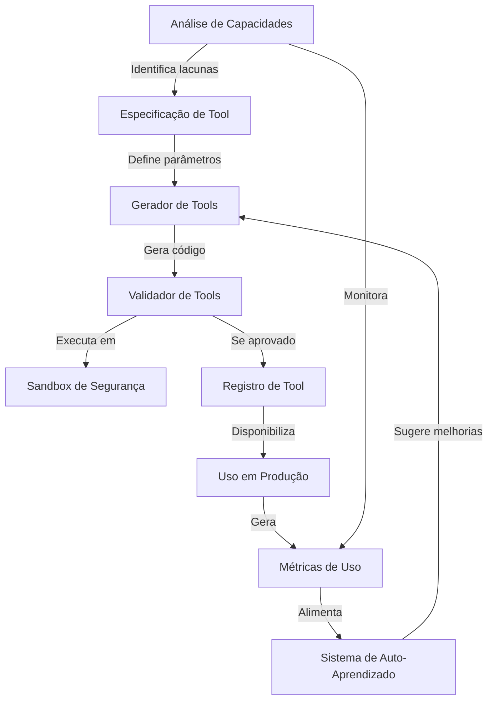

# Sistema de Auto-Extensão MCP

O sistema de auto-extensão permitirá ao SkyHAL identificar suas próprias limitações e gerar novas ferramentas (tools) para superar essas lacunas, tornando-o mais adaptável e poderoso ao longo do tempo.

## Componentes Principais

Criei uma especificação detalhada para cada artefato necessário no arquivo auto-extensao-artefatos.md. Aqui estão os principais componentes:

1. **Analisador de Capacidades**
   - Identifica limitações no sistema atual
   - Avalia métricas de desempenho e feedback dos usuários
   - Recomenda áreas para melhoria

2. **Gerador de Tools**
   - Cria novas ferramentas baseadas nas lacunas identificadas
   - Utiliza templates e especificações bem definidas
   - Gera código Python seguro e testável

3. **Validador de Tools**
   - Testa as tools geradas em ambiente sandbox
   - Realiza verificações de segurança
   - Avalia desempenho e funcionalidade

4. **Sistema de Auto-Aprendizado**
   - Coleta métricas sobre o uso das tools
   - Analisa padrões e gargalos
   - Sugere melhorias para as tools existentes

5. **Sandbox de Segurança**
   - Ambiente isolado para execução segura
   - Controle de recursos e permissões
   - Previne riscos de segurança

6. **Observabilidade**
   - Métricas específicas para auto-extensão
   - Tracing de operações críticas
   - Dashboards Grafana dedicados

7. **API de Auto-Extensão**
   - Endpoints para controle do sistema
   - Solicitação manual de análises e geração

8. **Testes Unitários**
   - Validação de cada componente
   - Mocks para dependências externas

9. **Documentação**
   - Guias de uso e configuração
   - Troubleshooting e boas práticas

## Arquitetura e Fluxo

O sistema segue a Clean Architecture conforme determinado nas instruções, com clara separação entre domínio, aplicação, infraestrutura e apresentação:

## Segurança

O sistema incorpora várias camadas de segurança:

- Validação rigorosa de todas as entradas via Pydantic
- Execução isolada em sandbox com limites de recursos
- Análise estática e dinâmica do código gerado
- Logging estruturado para auditoria
- Controles de autorização para acesso à API

## Observabilidade

Integramos completamente com o sistema de observabilidade conforme instruções específicas:

- Métricas Prometheus para geração, validação e uso
- Tracing com OpenTelemetry para operações críticas
- Logs estruturados com contexto enriquecido
- Alertas para falhas em processos de geração

## Próximos Passos

Para implementar este sistema, sugiro a seguinte ordem:

1. Criar a infraestrutura básica de sandbox e segurança
2. Implementar o analisador de capacidades
3. Desenvolver o gerador e validador de tools
4. Integrar observabilidade e métricas
5. Implementar API e documentação
6. Adicionar sistema de auto-aprendizado

## Relação com as Instruções Técnicas

A implementação segue rigorosamente:

- **python-mcp.instructions.md**: Estrutura de dados, tratamento de erros e práticas recomendadas
- **api-security.instructions.md**: Validação de entrada e proteções de segurança
- **observabilidade.instructions.md**: Métricas, tracing e logging
- **test.instructions.md**: Estratégias de teste para cada componente
