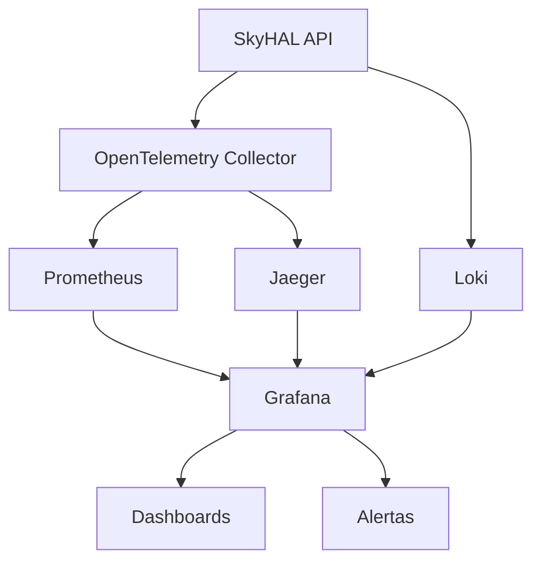

# 📊 Stack de Observabilidade SkyHAL

## 🎯 Visão Geral

A stack de observabilidade do SkyHAL implementa as três dimensões fundamentais da observabilidade:

- **📝 Logging** - Logs estruturados em JSON com correlação
- **📈 Métricas** - Métricas RED (Rate, Errors, Duration) via OpenTelemetry/Prometheus
- **🔍 Tracing** - Rastreamento distribuído via OpenTelemetry/Jaeger

## 🏗️ Arquitetura



### Componentes

| Componente | Função | Porta | URL |
|------------|--------|-------|-----|
| **Grafana** | Visualização e alertas | 3000 | http://localhost:3000 |
| **Prometheus** | Coleta de métricas | 9090 | http://localhost:9090 |
| **Jaeger** | Rastreamento distribuído | 16686 | http://localhost:16686 |
| **Loki** | Agregação de logs | 3100 | http://localhost:3100 |
| **OTEL Collector** | Centralizador de telemetria | 4317/4318 | http://localhost:8888 |

## 🚀 Quick Start

### ⚠️ Pré-requisito Importante

**Docker só funciona em ambiente WSL.** Certifique-se de estar executando em WSL antes de iniciar a stack.

### 1. Iniciar a Stack

**Windows (WSL):**
```powershell
cd infra/grafana
.\scripts\setup.ps1
```

**Linux/macOS:**
```bash
cd infra/grafana
chmod +x scripts/setup.sh
./scripts/setup.sh
```

### 2. Acessar Interfaces

- **Grafana**: http://localhost:3000 (admin/admin123)
  - Dashboard API Overview
  - Dashboard RED Metrics
  - Dashboard de Traces

- **Prometheus**: http://localhost:9090
  - Métricas e queries PromQL

- **Jaeger**: http://localhost:16686
  - Traces distribuídos

### 3. Testar Observabilidade

```bash
# Gerar tráfego para métricas
curl http://localhost:8000/health
curl http://localhost:8000/metrics

# Ver logs estruturados
docker-compose logs skyhal-api

# Verificar traces no Jaeger
# Acesse http://localhost:16686 e procure por "skyhal-api"
```

## 📖 Documentação Detalhada

### Configuração
- [📝 Logging Estruturado](./configuration/logging.md)
- [📊 Métricas OpenTelemetry](./configuration/metrics.md)
- [🔍 Tracing Distribuído](./configuration/tracing.md)
- [📤 Exportadores](./configuration/exporters.md)

### Uso
- [👨‍💻 Guia para Desenvolvedores](./usage/developers.md)
- [⚙️ Guia para Operadores](./usage/operators.md)
- [🔧 Troubleshooting](./usage/troubleshooting.md)

### Dashboards
- [📊 Dashboard Principal](./dashboards/api-overview.md)
- [📈 Métricas RED](./dashboards/red-metrics.md)
- [🎨 Dashboards Customizados](./dashboards/custom-dashboards.md)

### Alertas
- [🚨 Configuração de Alertas](./alerts/README.md)

## 🛠️ Personalização

### Adicionando Novas Métricas

```python
from src.infrastructure.observability import get_observability_providers

# Obter provedores
_, metrics_provider, _ = get_observability_providers()

# Incrementar contador customizado
metrics_provider.increment_counter(
    "custom_operations_total",
    labels={"operation": "data_processing", "status": "success"}
)

# Definir gauge customizado
metrics_provider.set_gauge("active_connections", 42.0)
```

### Adicionando Logs Contextuais

```python
from src.infrastructure.observability import get_observability_providers

# Obter logger
logging_provider, _, _ = get_observability_providers()
logger = logging_provider.get_logger("my_component")

# Log estruturado
logger.info(
    "Operação concluída",
    operation="data_sync",
    duration_ms=150,
    records_processed=1000
)
```

### Criando Spans Personalizados

```python
from src.infrastructure.observability import get_observability_providers

# Obter provedor de tracing
_, _, tracing_provider = get_observability_providers()

# Criar span
with tracing_provider.create_span("custom_operation") as span:
    span.set_attribute("user_id", "12345")
    span.set_attribute("operation_type", "sync")

    # Sua lógica aqui
    result = perform_operation()

    span.set_attribute("result_count", len(result))
```

## 🔍 Troubleshooting

### Stack não sobe

```bash
# Verificar Docker
docker info

# Verificar portas em uso
netstat -tlnp | grep -E "(3000|9090|16686|3100|4317)"

# Logs da stack
docker-compose logs -f
```

### Métricas não aparecem

1. Verificar se a aplicação está expondo `/metrics`
2. Verificar configuração do Prometheus
3. Verificar se OTEL Collector está funcionando

### Traces não aparecem

1. Verificar configuração OpenTelemetry na aplicação
2. Verificar se Jaeger está recebendo dados
3. Verificar sampling rate

## 🚦 Status e Saúde

### Health Checks

- **Grafana**: `curl http://localhost:3000/api/health`
- **Prometheus**: `curl http://localhost:9090/-/healthy`
- **Jaeger**: `curl http://localhost:16686/`
- **Loki**: `curl http://localhost:3100/ready`

### Métricas de Sistema

Cada componente expõe suas próprias métricas de saúde:

- Grafana: `/metrics`
- Prometheus: `/metrics`
- OTEL Collector: `:8888/metrics`

## 📚 Referências

- [OpenTelemetry Documentation](https://opentelemetry.io/docs/)
- [Prometheus Documentation](https://prometheus.io/docs/)
- [Grafana Documentation](https://grafana.com/docs/)
- [Jaeger Documentation](https://www.jaegertracing.io/docs/)

## 🤝 Contribuindo

Para adicionar novos dashboards, métricas ou melhorar a observabilidade:

1. Siga os padrões em `.github/instructions/observabilidade.instructions.md`
2. Teste localmente com a stack completa
3. Documente mudanças neste README
4. Adicione testes apropriados
