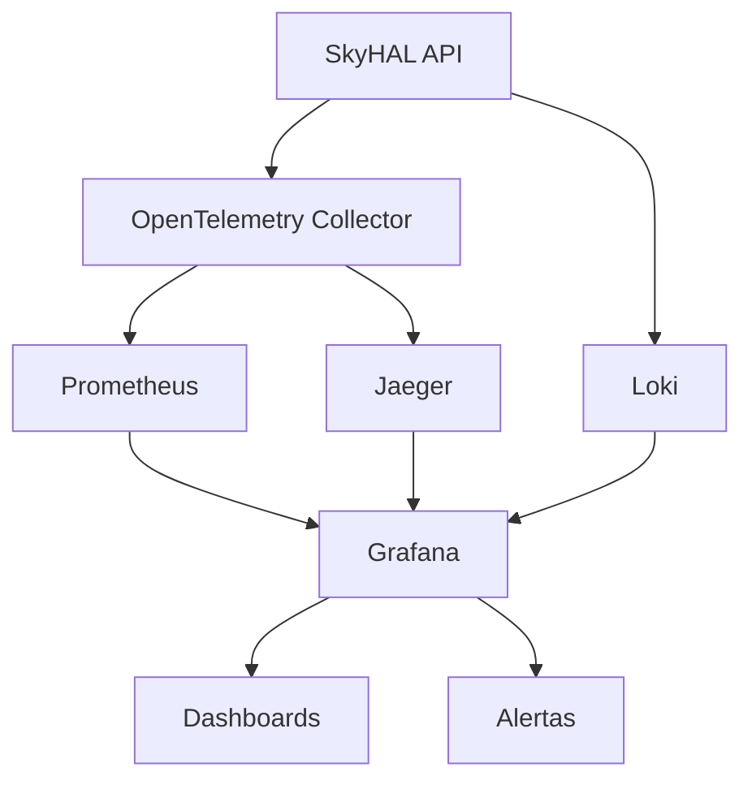

# Arquitetura da Observabilidade – SkyHAL

## Visão Geral

A stack de observabilidade do SkyHAL cobre logging estruturado, métricas (Prometheus/OpenTelemetry) e tracing distribuído (OpenTelemetry/Jaeger), integrando todos os componentes core do sistema de auto-extensão.

## Componentes

- **OpenTelemetry Collector**: Centraliza e exporta métricas/traces
- **Prometheus**: Coleta e armazena métricas
- **Grafana**: Visualização de métricas, logs e traces
- **Jaeger**: Tracing distribuído
- **Loki**: Agregação de logs estruturados

## Diagrama

## Instrumentação

- **Métricas**: RED (Rate, Errors, Duration) + customizadas
- **Tracing**: Spans nomeados por operação core, atributos de negócio
- **Logs**: JSON, correlação com trace_id/span_id

## Referências

- [README Observabilidade](./README.md)
- [Guia para Devs](./usage/developers.md)
- [Configuração](./configuration/README.md)
